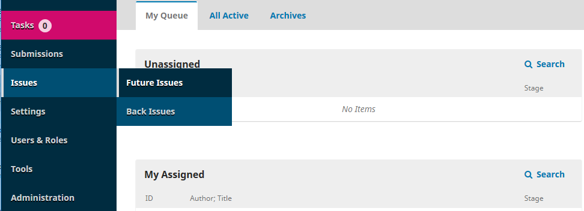
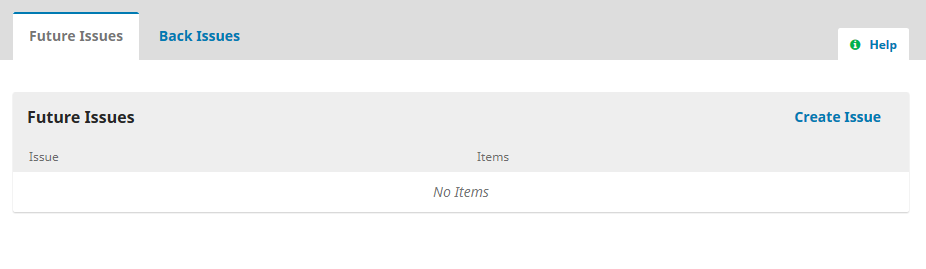
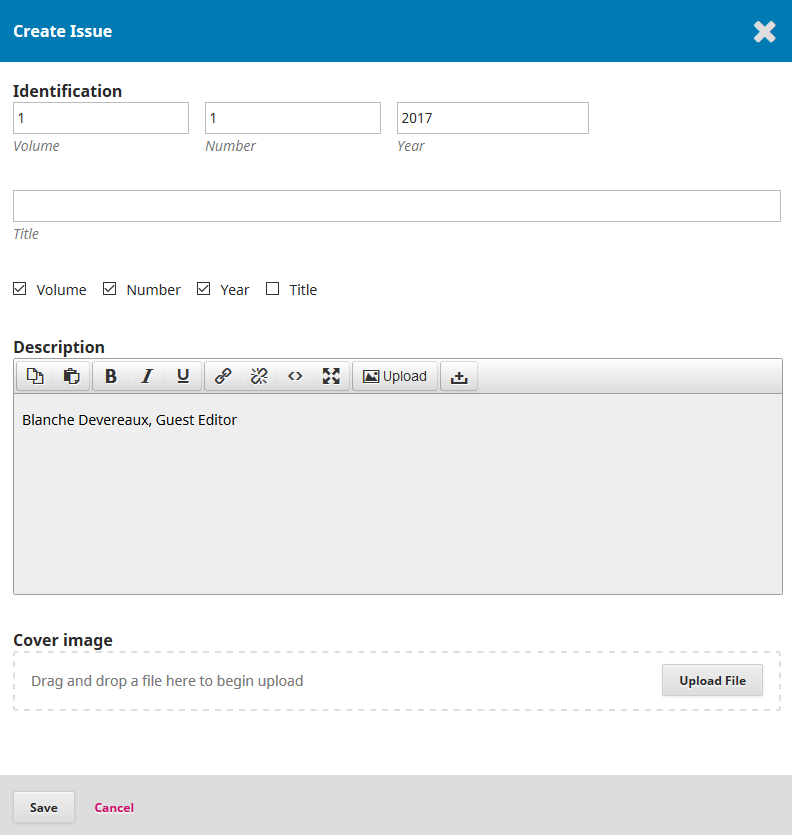

## Creating New Issues
To create a new issue, select **Issues** from the navigation menu and choose **Future Issues**.

Click **Create Issue**.

Enter the issue information. Typically journals will include a volume number, issue number, and publication year. However, if a journal does not use the volume/issue structure, articles can be published on a rolling basis. 

Including a title is useful for theme issues and the description field is a good place to include any information about guest editors.

There is also the option to upload a cover image for the issue.

