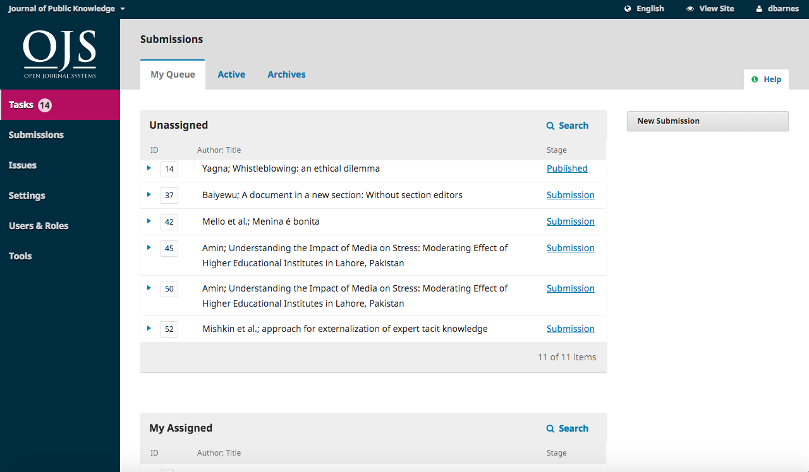
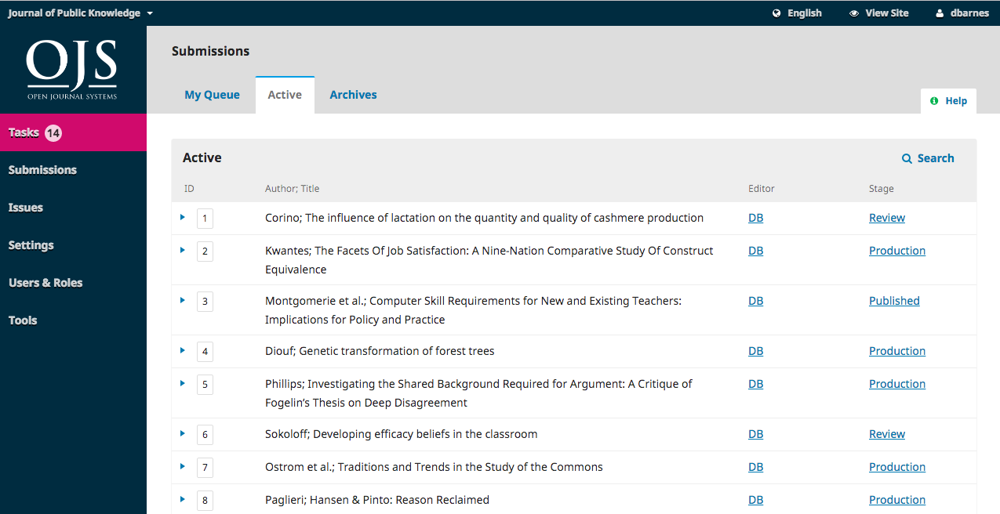
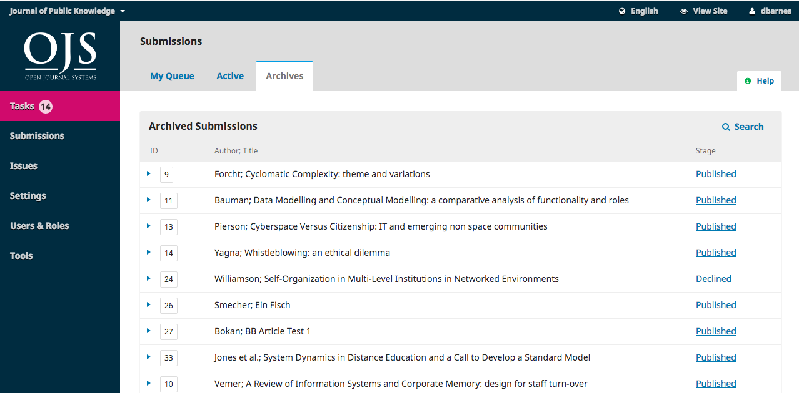
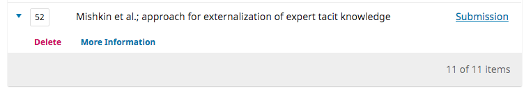
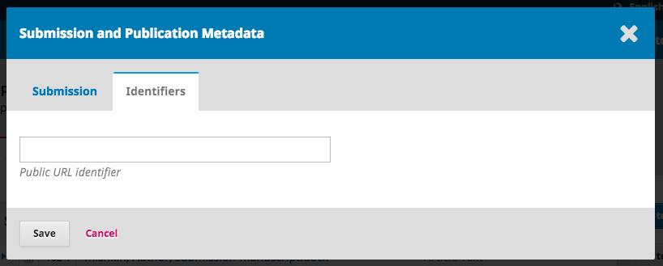
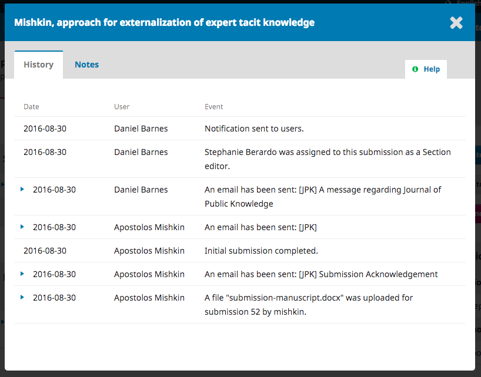
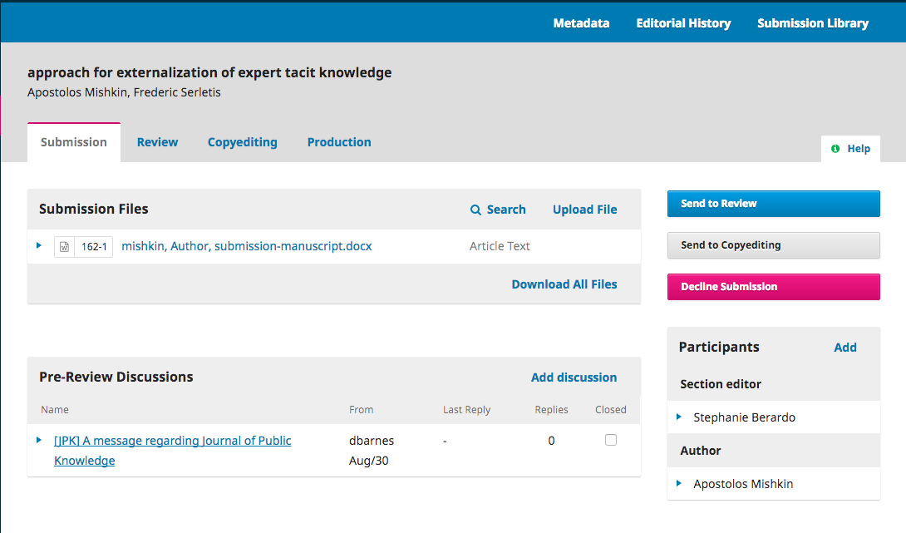
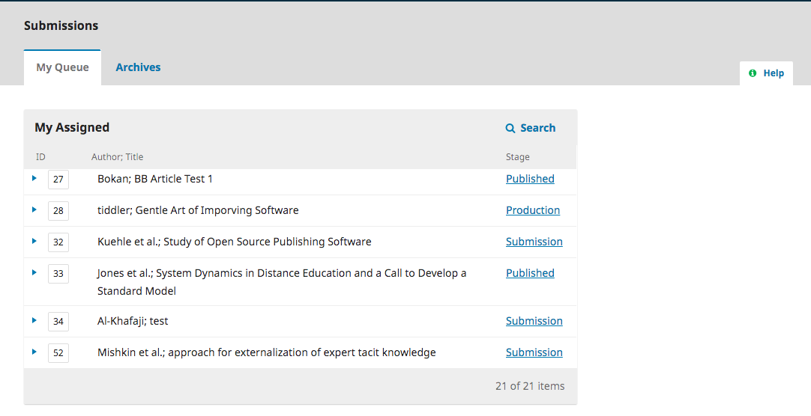

# 1.3 Review
When the submission enters the Review Stage, a notification indicates that Reviewers need to be assigned.

From the Reviewers panel, you can select Add Reviewer to assign a new Reviewer.

This opens a new window, where Reviewers are listed and can be selected one at a time.

Note the details visible about the Reviewers, including their interests, past assignments, etc.

At the bottom of this form, you will see options to:

**Select Reviewer**: Use this to confirm your selection once you have picked a Reviewer from the list.

**Create New Reviewer**: If none of the Reviewers are suitable, you can use this button to create a new Reviewer. This is a new account in the system.

**Enroll Existing User**: If none of the Reviewers are suitable, you can enroll an existing user as a Reviewer.

For this demonstration, we will pick Adela as our Reviewer and hit the **Select Reviewer** button.

This initiates a new window with a message for the Reviewer.

You can revise any of the prepared text.

Further down the form, you will see the additional details that are sent to the Reviewer including title, abstract, important dates, and a link to the files to be reviewed.

Hit the **Add Reviewer** button to send the message and assign the Reviewer.

Back on the Review Stage, we can see the Reviewer is now listed.

**Review Details**: Provides details on the review.

**Email Reviewer**: Allows you to send a message to the Reviewer.

**Edit Review**: Allows you to change the review dates and files.

**Unassign Reviewer**: Allows you to unassign the Reviewer.

**History**: Provides a brief history of the review.

At this point, we could add additional Reviewers, and then wait for their recommendations to come in.

## Responding to Reviews
Once the Reviewers have completed their work, the Section Editor can see the results in their dashboard. Here they will see notifications that new reviews have been submitted and whether all reviews are in.

Use the *Read Review* link in the Reviewers panel to read the comments from the Reviewers, including those for both the Author and Editor as well as for the Editor only.

Select the *Confirm* link at the bottom of the screen.

In the Reviewers panel, you can now see a *Thank Reviewer* link. Choose that to thank the Reviewer.

Hit the **Thank Reviewer** button to send the message.

## Making the Decision
