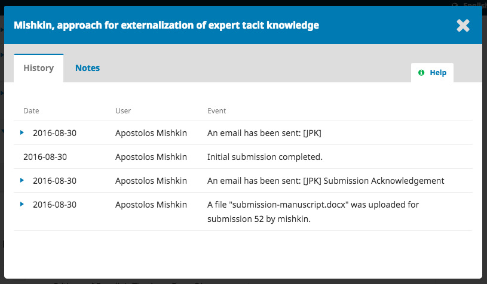
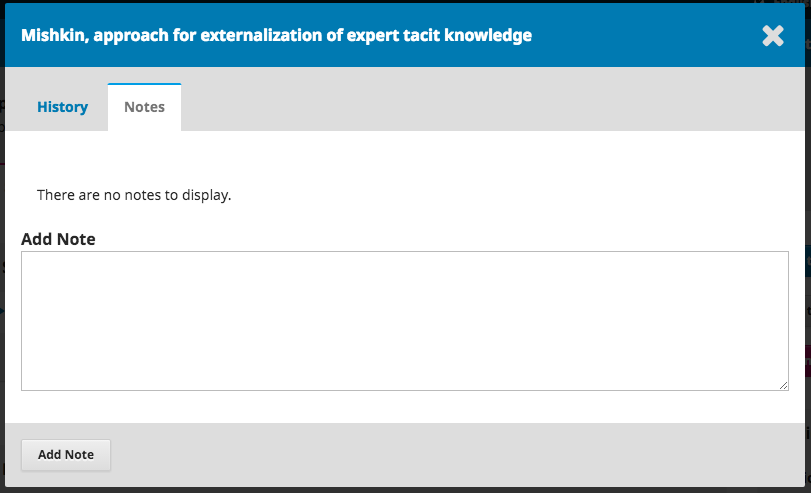
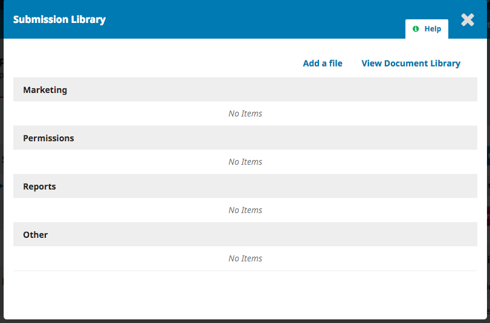

# 1.2 Submissions
When an author makes a new submission to your journal, the editor is automatically emailed. When you log into your Dashboard, you can find it either from your Tasks, or from one of the queues (My Queue, Active, and Archives).

## My Queue
This page is divided into 3 sections:

**Unassigned**: This panel includes submissions added to sections without section editors.

**My Assigned**: This panel includes submissions added to sections where you are a section editor.

**My Authored**: This panel includes submissions that you wrote, and should be assigned to a different editor.

The Search tool for each queue can sometimes be helpful in tracking down submissions.

## Active
This section includes a list of all submissions, without being organized into queues.

## Archived
This section includes a list of all submissions either rejected or already published by the journal.

## Submission Options
Once you find the submission, you can use the blue arrow to reveal options to **Delete** or find **More Information**.

**Delete** will remove the submission and **More Information** will bring up the submission's history.

## Submission Record
To view the submission in more detail, select the *Submission* link to the right of the title. This will take you to the submission record.

From here, you can see:

**Submission Files**: This panel lists the files that have been submitted. In this view, there is just one file, but multiple files could have been submitted.

**Pre-Review Discussions**: This panel allows the editor to communicate with the author, or with others on the editorial team. For example, to ask the author for some additional information, or to ask a section editor to take responsibility for this submission.

**Participants**: This panel is where you will see the list of participants involved in the submission. Currently, there is only the submission author's name. Other names (editors, section editors, etc.) will appear here as they are added in subsequent steps.

In addition, in the blue bar along the top, you can see:

**Metadata**: Where you can view and revise the submission metadata.

Use the **Identifier** tab to also view or add a unique identifier.

**Editorial History**: Where you can view the history and any notes about the submission.

Use the Notes tab to also view or add any editorial notes.

**Submission Library**: Where you can add any relevant documents to the submission's library.

## Assigning the Submission

To move the submission forward, the next step is to assign an editor or section editor. To do so, select the Add link in the **Participants** panel.

You will have the option to locate a user by role, choose an individual, and send them a message requesting their assistance.

Hit the OK button to make the assignment and send the message.

You can now see that the Section Editor is listed under Participants, and new Action buttons are available:

**Send to Review**: Moves the submission on to the next stage.

**Send to Copyediting**: Skips the Review Stage and moves the submission directly into Copyediting.

**Decline Submission**: Rejects the submission before going through the review process. The submission would then be archived.

Although in this example, the editor assigned a section editor, it would also be possible for the editor to assign herself to the submission.

## Section Editor (or Guest Editor)
Now that the Section Editor has been assigned, she can login and view her dashboard. The submission can be found at the bottom of the My Assigned queue.

Clicking on the Submission link opens the full submission record.

Note the **Pre-Review Discussion**, which was the Editor's invitation to edit, as well as Stephanie now being in the **Participants** list.

## Accepting the Assignment
It is not required, but the Section Editor could reply to the Pre-Review Discussion to inform the editor that she will be proceeding with the assignment.

## Communicating with the Author
If the Section Editor has any questions for the author, she can use the Pre-Review Discussions.

## Sending to Review
Once the Section Editor is satisfied that the submission is appropriate for the journal, she can select the **Send to Review** button to move the submission to the next stage.

Keep the files that are to be reviewed checked off.