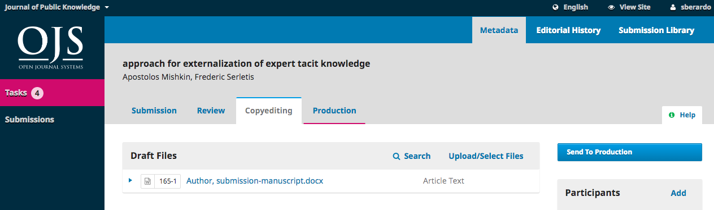
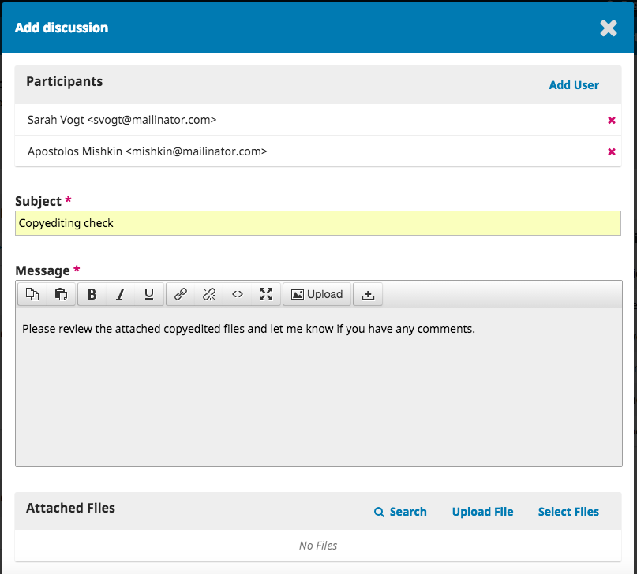

## New Issues
To create a new issue, select **Issues** from the navigation menu and choose **Future Issues**.

Click **Create Issue**.

Enter the issue information. Typically journals will include a volume number, issue number, and publication year. However, if a journal does not use the volume/issue structure, articles can be published on a rolling basis. 

Including a title is useful for theme issues and the description field is a good place to include any information about guest editors.

There is also the option to upload a cover image for the issue.

## Publish Issues

Find the issue that is ready for publication under *Future Issues*. Click on the issue link to see the order of articles in the table of contents.

Clicking on the **Order** link allows you to change the article order. When satisfied with the order, click on the X to close the box.

To preview and publish the issue, click on the triangle next to the issue link to reveal the options menu.

When ready, click **Publish Issue** and confirm that you are ready to publish by clicking **OK**.

The issue is now published. If you need to un-publish an issue for any reason, you can find it in the *Back Issues* section. Click on the triangle next to the issue link to reveal the options menu and select **Unpublish Issue**.

Once un-published the issue will move back to the *Future Issues* section.

