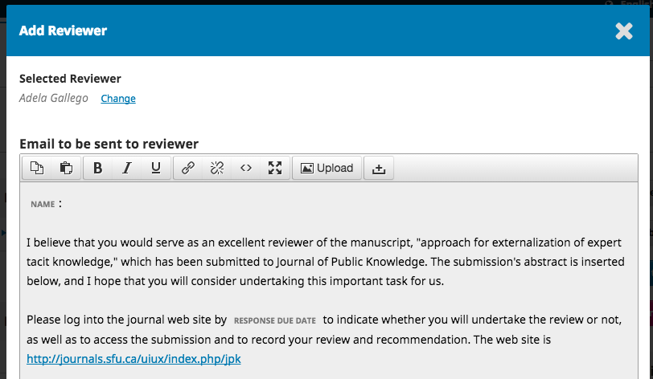
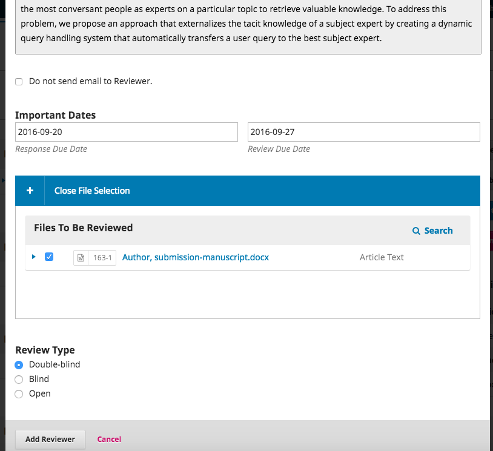

# 1.6 Production

Most journals with small production staff combine copyediting and layout into one stage. In many cases, it is the editor herself who does this work. If the journal does have a separate copy editor and see [1.5. Copyediting](./1-5-copyediting.md)

Download the draft file from the *Copyediting* and click **Send to Production** to move the submission to the next stage.

When copyediting and layout is finished, simply upload the final PDF file to the *Galleys* section of the production stage.

Click **Add galley**:

Enter a label for the galley file. Most journals use either *PDF* or *Full Text*. This label appears on the article download button in the table of contents. Leave the "This galley will be available at a separate website." option unchecked.

Click **Save**.

Next, select the *Article Component* for which you are uploading a galley. Then click the **Upload File** button to choose the final PDF.

Click **Continue** to review the details.

Click **Continue** and **Complete** to confirm the upload.

The last step is to schedule the article for publication in an upcoming issue. Click the **Schedule for Publication** button.

Select the issue to which the article should be assigned and enter the page numbers to appear in the table of contents. Depending on the journal's copyright and licensing policies, individual permissions can be entered for each article. In this example the authors retain their copyright and the article is licensed under a Creative Commons CC BY 4.0 license.

