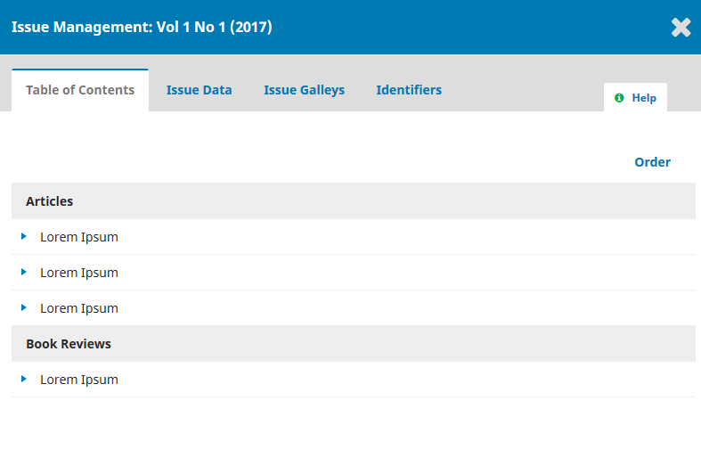
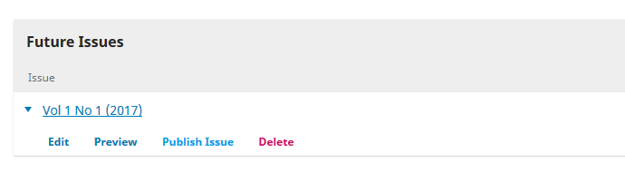
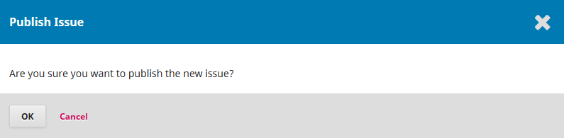
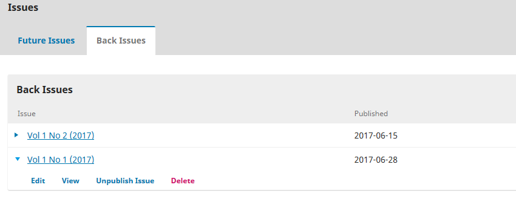

## 1.7 Publication

Find the issue that is ready for publication under *Future Issues*. Click on the issue link to see the order of articles in the table of contents.

Clicking on the **Order** link allows you to change the article order. When satisfied with the order, click on the X to close the box.

To preview and publish the issue, click on the triangle next to the issue link to reveal the options menu.

When ready, click **Publish Issue** and confirm that you are ready to publish by clicking **OK**.

The issue is now published. If you need to un-publish an issue for any reason, you can find it in the *Back Issues* section. Click on the triangle next to the issue link to reveal the options menu and select **Unpublish Issue**.

Once un-published the issue will move back to the *Future Issues* section.