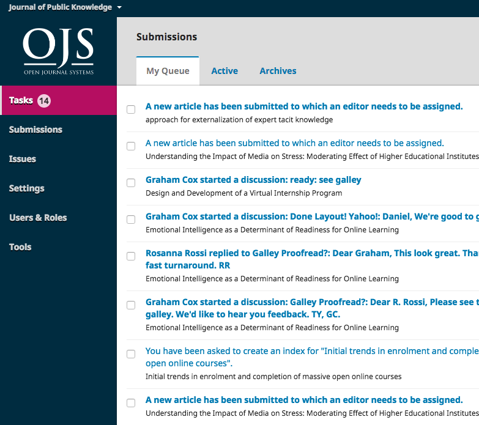

# 1. Editorial Workflow
This section covers the steps editors and/or managing editors undertake to create and publish a new journal issue.

## Tasks
Your Tasks are available from the left menu of your Dashboard. Note the number "14" in the image below. This indicates that there are 14 tasks in your list.

Tasks provide a quick look at items that need your attention. Bold entries are unread, and unbold entries have been read.

Use the checkbox to mark tasks for deletion (the delete link is available at the bottom of the list).