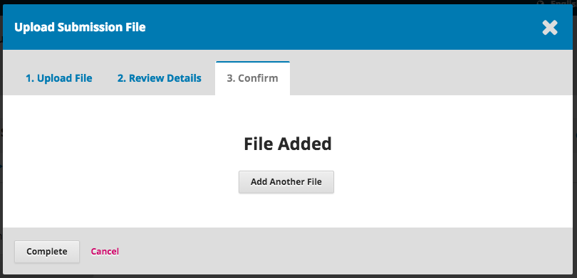
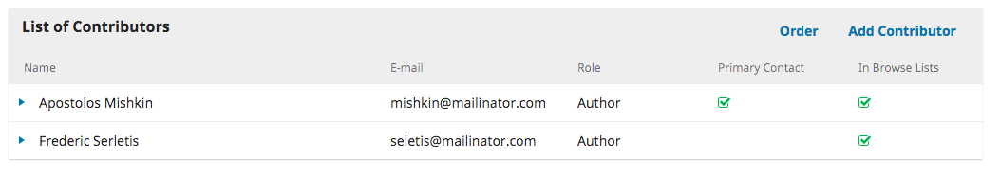
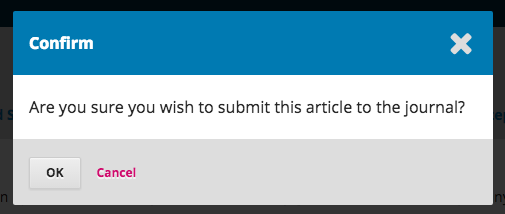

# 2.1 Submitting an Article
Start a new submission by clicking the **New Submission** button on the right side of the screen. You will be taken to Step 1 of a 5-Step process to upload and describe your submission. 

##Step 1

In **Step 1** you will provide preliminary information about your submission.

To begin select the appropriate section for your submission (e.g., article, review, etc.). If you aren’t sure which section is appropriate, make your best guess. 

Read and agree to the statements in the submission checklist by checking each box. Include any comments for the editor, read the journal’s privacy statement, and then click the **Save and Continue** button to move to **Step 2**.
 
##Step 2

On **Step 2**, a window will open allowing you to upload your submission file.

First, you MUST select an Article Component. This lets the system know whether the file is the body of the manuscript, an image, a data set, etc. **This must be selected before your file will upload**.

Once you’ve made that selection, you can then upload your first file. It is important to note that you can only upload **one** file at a time. Additional files can be uploaded later in the process. Typically, this first file will be the body of your manuscript. Hit the **Continue** button once the file uploads.

After uploading the file, you will be asked to review the name of the file. Use the Edit link to make any changes.

Click the **Continue** button.

Next, you have the option to repeat the process to upload additional files (e.g., a data set or an image). 

Once you have finished uploading all of your files, click **Complete**; this will close the upload window.

You will be brought back to the *Submit an Article* screen where you will see the files you’ve uploaded. If you need to make changes, expand the blue arrow to the left of your file and make any changes using the *Edit* link. 

Click ‘Save and Continue’ to move to Step 3.

##Step 3

On **Step 3**, you will be asked to add more information about the submission, including the title of the submission (broken down into prefix, title, and subtitle), the abstract, and scrolling down...

...any additional contributors.

You can add more contributors (e.g., co-authors), by clicking the **Add Contributors** link. This will open a new window with fields to enter their information.

Hit **Save**, and the new contributor will appear on the screen.

Depending on the journal you are submitting to, you may see additional fields to complete, such as keywords. 

To enter keyword, simply type the word or phrase and hit your Enter key. The word or phrase will be formatted as a keyword.
 
Click **Save and Continue** to move forward.

##Step 4

On Step 4, you will be asked to confirm that you are happy with your submission. 

Click **Finish Submission**.

A box will pop up asking you to confirm you are finished. Click **OK**.

##Step 5

Your submission is now complete! The editor has been notified of your submission. At this point, you can follow the links to:

- Review this submission
- Create a new submission
- Return to your dashboard

##Dashboard
And here is your submission in your Dashboard. You can see that it is currently in the *Submission* stage.

Over the coming days, it will move into the Review stage, and if accepted, into the Copyediting and Production stages before being published.