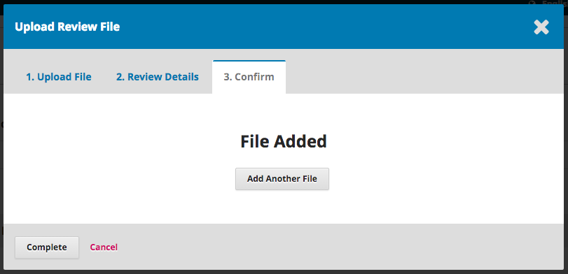
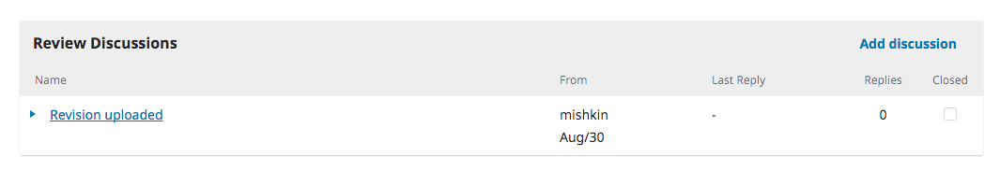
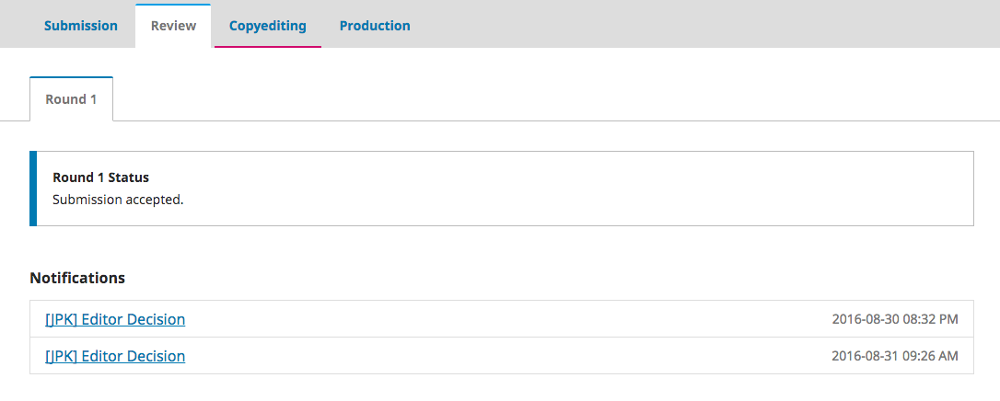
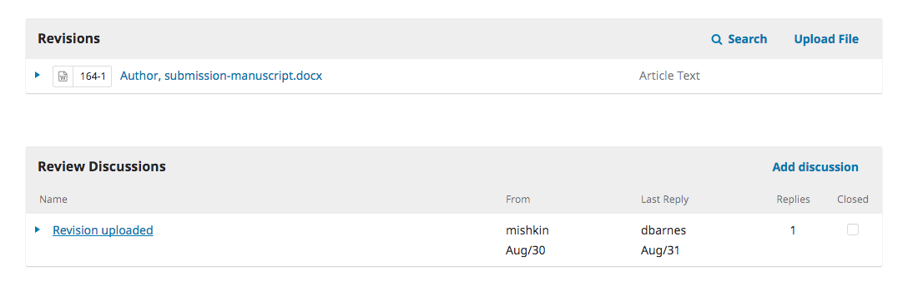
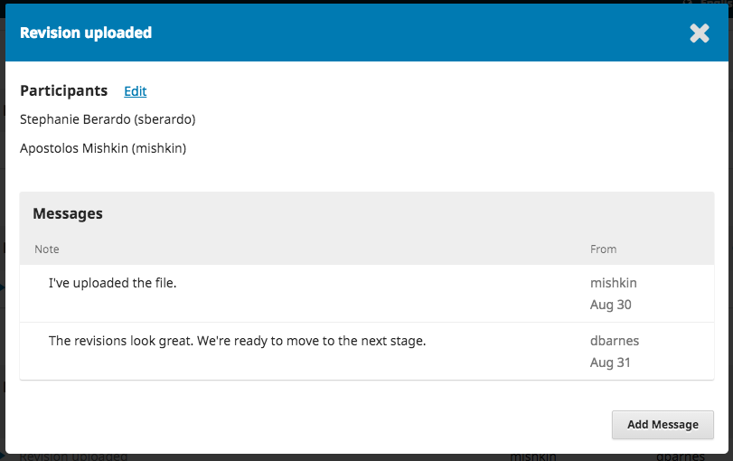

# 2.2 Responding to a Review
Once the review process has completed, you will be notified via email by the editor of their decision.

After receiving the email, login to your dashboard.

Select the *Review* link next to your submission to view the decision.

From here, you can see the decision (revisions requested) and a link to the editor's notification.

Based on the information in the editor's message, you must now prepare your revisions.

## Uploading the Revised File

By scrolling down the page, you will find a panel for **Revisions**.

Use the *Upload a File* link to upload your revised manuscript.

Use the dropdown menu to choose that you are uploading a revision of an existing file.

Then upload the revised file and hit **Continue**.

Check the file details and hit **Continue** again.

If you have any additional files to upload, do so now. Otherwise, hit **Complete**.

Your revised file is now visible in the Revisions panel.

##Inform the Editor

Your next step is to inform the editor that the revised file is now available. To do so, go to the **Review Discussion** panel.

From there, select the *Add Discussion* link.

Use the *Add User* link to add the editor.

Add a subject line and a message.

Hit **OK** to send the message.

An email has now been sent to the editor and you (and the editor) can see the message in the Review Discussions panel.

At this point, the author needs to wait to hear back from the editor as to whether the revisions are acceptable.

##Revisions Accepted

You will receive an email that your revisions have been accepted.

In addition, notifications will appear on your dashboard.

The later notification is the current one. Click on it to open the message (which is the same as the email you would have also received).

Use the **X** in the upper right corner to close the window.

Further down your dashboard, you will also see a discussion reply from the editor.

Clicking the discussion title will open it up.

Congratulations! You've been accepted and your submission file is moving on to the Copyright stage.