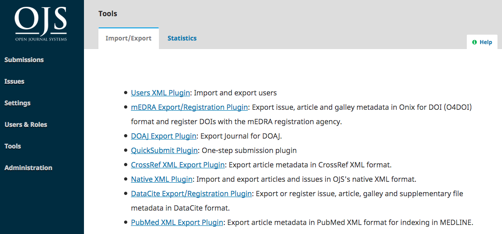
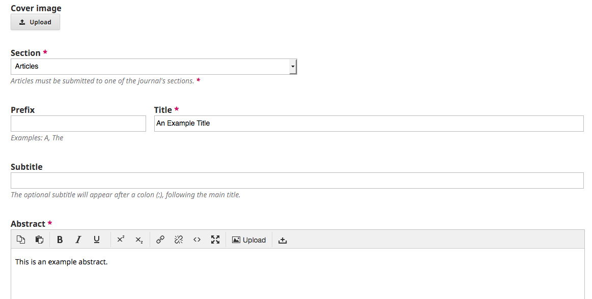
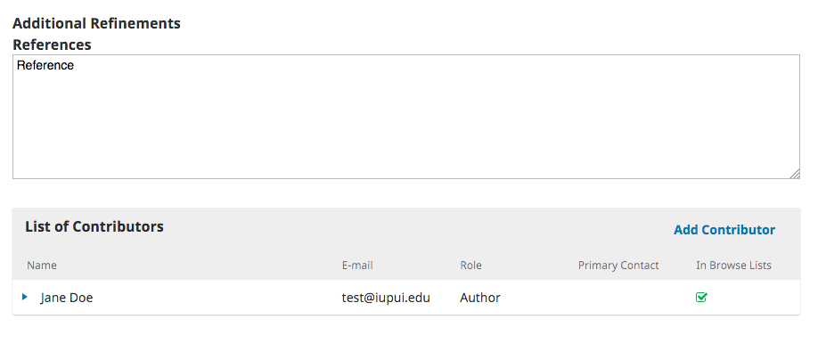
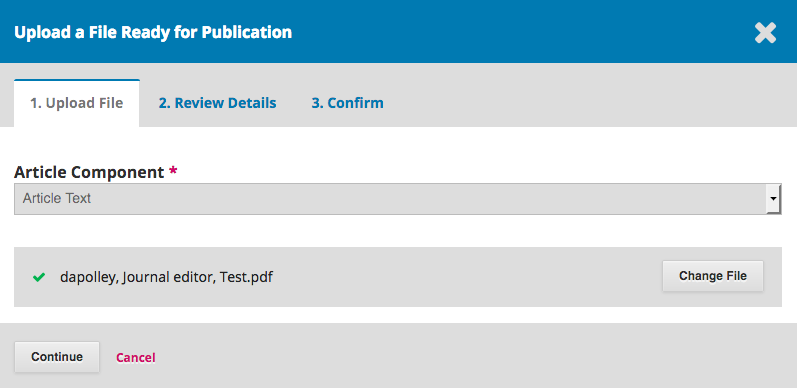

# 6. Quick Submit Plugin
The QuickSubmit Plugin provides a one-step submission process, allowing journal editors to upload final versions of articles as PDF files ready to be scheduled for publication. This plugin makes it possible to bypass the peer review and copyediting stages.

To accesss the plugin from the side menu, click **Tools > Import/Export**.

Click on the **QuickSubmit Plugin** link from the list of available plugins:

The QuickSubmit form allows users to choose the section in which the article will appear and enter basic metadata for the article, such as title, subtitle, and abstract.

If the journal's article submission process requires any additional metadata, such as references or keywords, these will appear in the QuickSubmit form. 

Next, add authors under the *Add Contributors* heading.

Upload the final PDF version of the article under the *Galleys* section.

Click **Add galley**, set the galley label to PDF, and click **Save**.

Select the *Article Component* and upload the final version of the article in PDF format.

 

Review the details and click **Complete**.

To submit articles directly to the production stage, select **Unpublished** or to submit articles directly to the current issue, select **Published**.

 

To compile articles into an issue and pubish that issue, see [1.6 Production](./1-6-production.md) and [1.7 Publication](./1-7-publication.md).