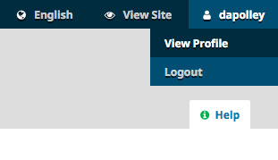
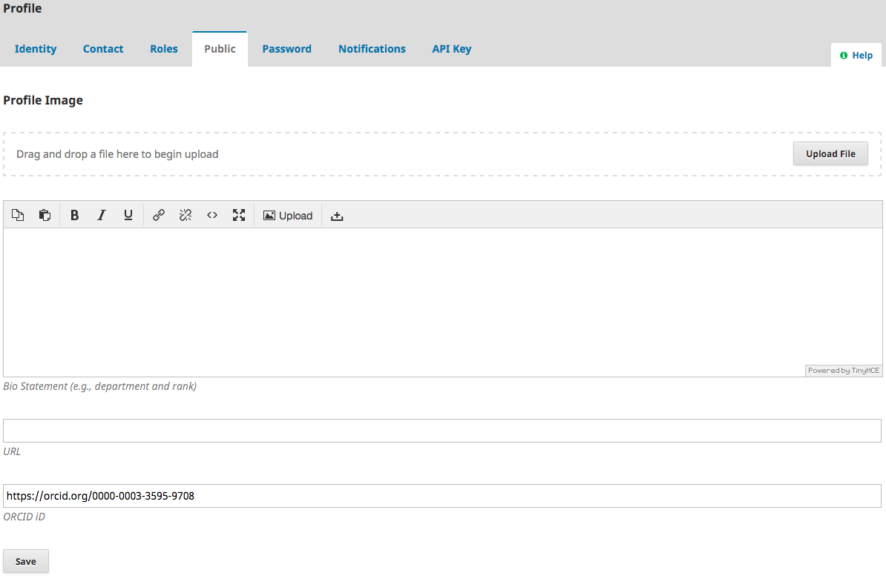
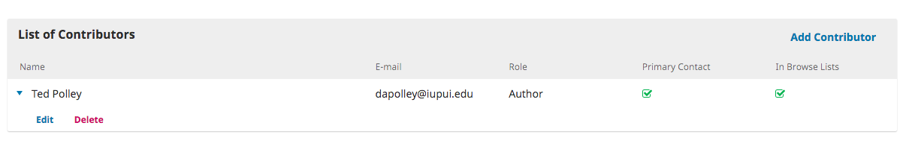
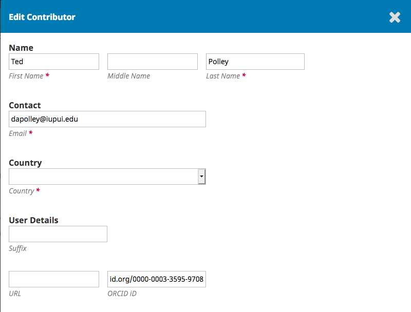

## Adding ORCID to Your Profile

If you have already registered with the journal, you can add your ORICD to your profile. Click on your username in the upper right-hand corner of the screen and select **View Profile**:

Next, click on the **Public** tab and add your ORCID to the appropriate field. Make sure to format the ID as a full URL:

## Add ORCID to Submission Metadata

You can add an ORCID for yourself and your co-authors during the article submission process. At the *Enter Metadata* stage, click next to the contributor's name and select **Edit**:

Add your ORCID to the appropriate field, making sure to format it as a full URL:

Do the same for your co-authors, if you know their ORCID.

The result of adding ORCID to your profile or the article submission metadata is that it will display on the landing page of the published article. This allows readers to click on it and view your ORCID profile, potentially increasing the number of times your other work is read and cited.